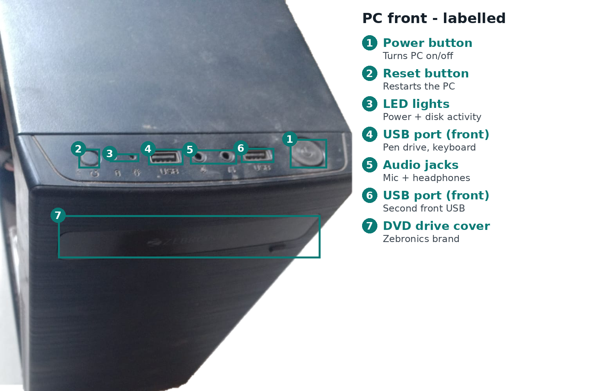
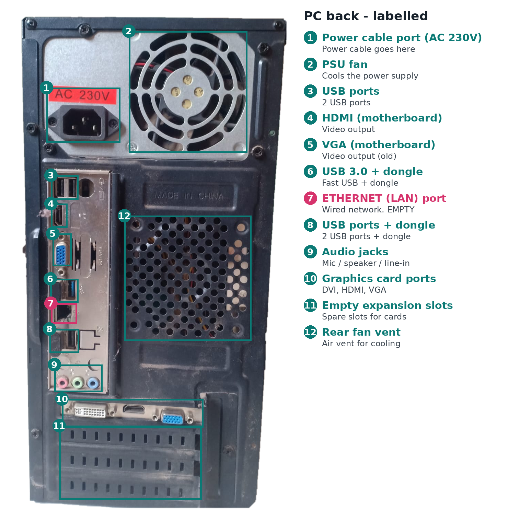

# Home Lab PC Hardware Inventory

This project documents a physical inspection of a desktop PC used for
home-lab learning and data-center hardware practice.

---

## Day 1 — Initial Physical Inspection

The first day focused on identifying and documenting the PC hardware
without removing any components.

---

## Task A — External Inspection

The PC was inspected from the outside before opening the case.

### Front of the PC

Identified:

- Power button
- Reset button
- Front USB ports
- Front audio jacks
- DVD/optical drive cover
- Zebronics case branding

### Rear of the PC

Identified:

- AC power input
- PSU cooling fan
- Rear USB ports
- Ethernet/LAN (RJ-45) port
- VGA port
- Graphics card video ports
- Rear audio jacks
- PCIe expansion slots

### External Inspection Notes

| Item | Status |
|---|---|
| PC case front | Identified |
| PC case rear | Identified |
| Power cable port | Identified |
| Ethernet/LAN port | Identified |
| USB ports | Identified |
| VGA port | Identified |
| HDMI/DisplayPort | Identified where visible |
| Audio ports | Identified |
| Model/serial label | Not clearly visible |

---

## Task B — Internal Inspection

After shutting down and disconnecting the PC, the side panel was opened
for visual inspection.

**No components were removed.**

### Components Identified

- Motherboard
- CPU cooler / CPU fan
- RAM sticks
- HDD
- 2.5-inch SATA SSD
- PSU
- Dedicated graphics card
- SATA data cable
- SATA power cables
- PCIe expansion slots

### Internal Inspection Notes

| Component | Status |
|---|---|
| Motherboard | Identified |
| CPU cooler | Identified |
| RAM | Identified |
| HDD | Identified |
| SSD | Identified |
| PSU | Identified |
| Graphics card | Identified |
| SATA data cable | Identified |
| SATA power cables | Identified |
| PCIe slots | Identified |

---

## Safety

- PC was powered off before inspection.
- Power cable was disconnected before opening the case.
- No components were removed during the initial inspection.
- Cables and components were not forced or disconnected.
- The PSU enclosure was not opened.

---

## Project Status

**Day 1 — Initial physical inspection: Completed**

Next step: collect system information and document CPU, RAM,
storage, motherboard, network adapter and other specifications.
