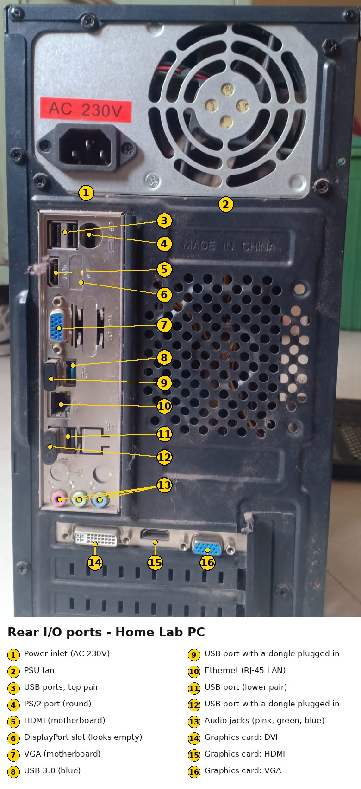

## Step 1: External Port Mapping

The PC was powered off and unplugged before inspection. I visually inspected the rear I/O panel and documented the available ports.

### Rear I/O Ports – Motherboard

| Port | Count | Notes |
|---|---:|---|
| USB Type-A | 6 | 2 top ports, 1 blue USB 3.0 port, and 3 additional USB ports |
| USB Type-C | 0 | Not present |
| PS/2 | 1 | Round keyboard/mouse port |
| Ethernet (RJ-45) | 1 | LAN/network connection |
| HDMI | 1 | Motherboard video output |
| VGA | 1 | Motherboard video output |
| DisplayPort | 1 opening | Appears empty/not populated; not counted as a usable port |
| 3.5 mm Audio | 3 | Pink – microphone, green – audio out, blue – line-in |

### Graphics Card – Zebronics GT610

| Port | Count |
|---|---:|
| DVI | 1 |
| HDMI | 1 |
| VGA | 1 |

### Other

- Power inlet: AC 230V
- PSU cooling fan: Present
- USB dongles: 2 plugged-in USB devices observed
- No components were removed.
- Only visual inspection was performed.

### Photo Evidence

